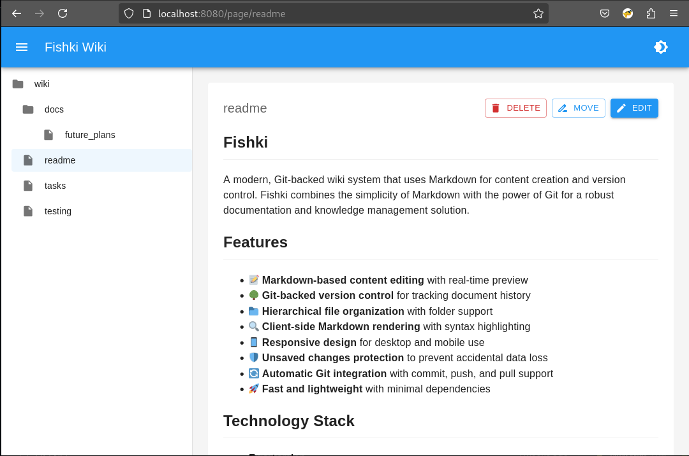

# Fishki

A modern, Git-backed wiki system that uses Markdown for content creation and version control. Fishki combines the simplicity of Markdown with the power of Git for a robust documentation and knowledge management solution.



## Features

- 📝 **Markdown-based content editing** with real-time preview
- 🌳 **Git-backed version control** for tracking document history
- 📁 **Hierarchical file organization** with folder support
- 🔍 **Client-side Markdown rendering** with syntax highlighting
- 📱 **Responsive design** for desktop and mobile use
- 🛡️ **Unsaved changes protection** to prevent accidental data loss
- 🔄 **Automatic Git integration** with commit, push, and pull support
- 🚀 **Fast and lightweight** with minimal dependencies

## Technology Stack

- **Frontend**:
  - React 18 with TypeScript
  - Material-UI (MUI) for consistent UI components
  - React Router v7 for client-side routing
  - React Markdown with rehype plugins for rendering
  - Context API for state management
  - Comprehensive test coverage with Jest

- **Backend**:
  - Go 1.21+ for high performance
  - Native Git integration via command-line operations
  - RESTful API for frontend communication
  - Embedded static file serving

## Installation

### Prerequisites

- Go 1.21 or later
- Node.js 18 or later
- npm
- Git

### Setup

1. Clone the repository:
   ```bash
   git clone https://github.com/timhughes/fishki.git
   cd fishki
   ```

2. Install frontend dependencies:
   ```bash
   cd frontend
   npm install
   ```

3. Build the frontend:
   ```bash
   npm run build
   ```

4. Build the backend:
   ```bash
   cd ..
   go build ./cmd/fishki-server
   ```

5. Run the server:
   ```bash
   ./fishki-server
   ```

6. Access the application at http://localhost:8080

## Usage

### Configuration

The application can be configured using environment variables or command-line flags:

- `PORT`: Server port number (default: 8080)
- `--bind`: Bind address (default: localhost)
- `--port`: Port to listen on (default: 8080)

### Git Configuration

Fishki uses your local Git configuration for commit author information:

```bash
git config --global user.name "Your Name"
git config --global user.email "your.email@example.com"
```

### Creating and Editing Pages

1. Navigate to the application in your browser
2. Use the file browser to navigate to the desired location
3. Click "Create Page" to create a new page
4. Use the Markdown editor to write content
5. Click "Save" to commit changes to Git

### File Organization

- Files are organized in a hierarchical structure
- Folders can be created by including slashes in the path
- Special index.md files can be used as folder landing pages

## Development

### Frontend Development

```bash
cd frontend
npm start
```

This starts the development server on http://localhost:3000 with:
- Hot reload
- Development error overlay
- Source maps
- ESLint integration

### Backend Development

```bash
go run ./cmd/fishki-server
```

The server will start on port 8080 by default.

### Testing

#### Backend Tests

```bash
go test ./...
```

#### Frontend Tests

```bash
cd frontend
npm test
```

## Architecture

### Frontend Architecture

The React frontend follows a component-based architecture with:
- Centralized API service layer for backend communication
- Custom React hooks for data fetching and operations
- Context API for global state management (navigation, unsaved changes)
- TypeScript for type safety throughout the codebase
- Material-UI for consistent design language
- Client-side Markdown rendering with syntax highlighting

### Backend Architecture

The Go backend is structured with:
- Clean architecture principles for maintainability
- Middleware-based HTTP handling for cross-cutting concerns
- Git integration for version control operations
- RESTful API endpoints for frontend communication
- Embedded static file serving for the React application

### API Endpoints

- `GET /api/files` - List all files and directories
- `GET /api/load?filename=path/to/file.md` - Load file content
- `POST /api/save` - Save file content
- `DELETE /api/delete` - Delete a file
- `POST /api/render` - Render Markdown to HTML (legacy)
- `POST /api/init` - Initialize Git repository
- `POST /api/pull` - Pull changes from remote
- `POST /api/push` - Push changes to remote

## Recent Improvements

- Upgraded to React Router v7 for improved navigation
- Added robust unsaved changes protection
- Migrated to client-side Markdown rendering with syntax highlighting
- Fixed Git integration issues with repository paths
- Improved error handling for 404 responses
- Enhanced navigation behavior between pages
- Added comprehensive test coverage

## License

This project is licensed under the GNU GENERAL PUBLIC LICENSE v3.0. License - see the LICENSE file for details.

## Acknowledgments

- React team for the frontend library
- Go team for the backend language
- Material-UI team for the component library
- All contributors who have helped shape this project
